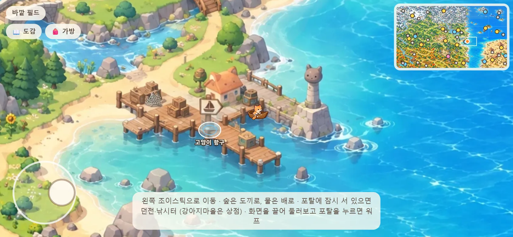
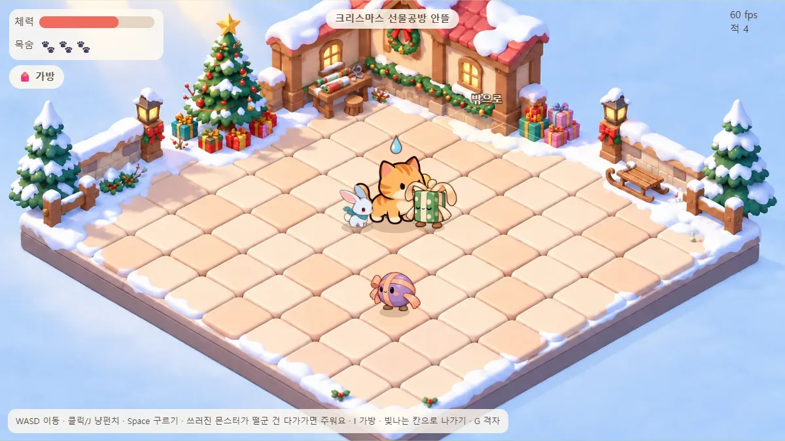
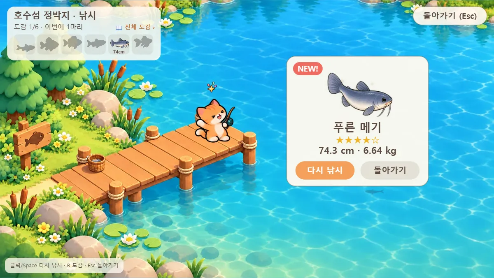
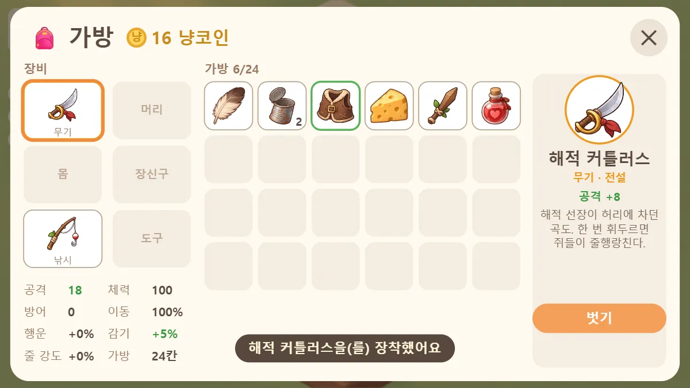
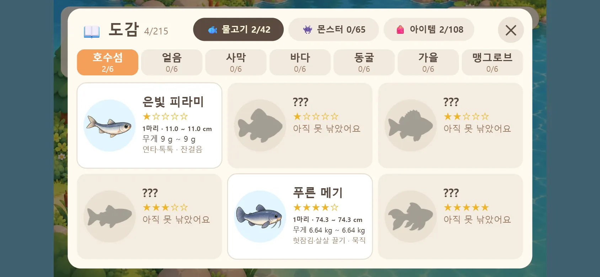

# 고양이는 실패하지 않아 (Cats Never Fail)

아기 고양이 **치즈**가 넓은 바깥 세상을 돌아다니며 던전에서 냥펀치를 날리고, 일곱 곳의 낚시터에서 물고기를 낚고,
고양이마을에서 요리해 친구들에게 먹여 주는 크롬 브라우저용 탑다운 액션 게임입니다. 쓰러져도 낮잠 한숨 자고 다시 일어나는 고양이답게, 실패해도 괜찮아요.

**▶ 바로 해 보기: https://leepillwoo.github.io/nyang/** (PC · 휴대폰 · 태블릿, 설치 없이 브라우저에서)



| 던전 | 낚시 |
| --- | --- |
|  |  |
| **가방 · 장비** | **도감** |
|  |  |

> 개발 중인 프로토타입입니다. 기획과 진행 상황은 [docs/GDD.md](docs/GDD.md) · [docs/PROGRESS.md](docs/PROGRESS.md) 에 있어요.

## 할 수 있는 것

- **바깥 필드** — 6×6 조각을 이어 붙인 큰 지도 (설산 · 숲 · 마을 · 가을 숲 · 바다 · 사막). 길은 걷고, 숲은 도끼로 헤치고 (가끔 통나무·도토리·버섯이 나오고,
  부스럭거리는 수풀을 베면 꼭 무언가 나와요. 튀어나와 도토리를 던지고 달아나는 다람쥐는 쫓아가 잡으면 숨겨 둔 걸 내놓아요),
  물은 배로 건넙니다. 눈밭·모래밭에선 걷는 모습이 바뀌어요. 이정표 41곳에 포탈이 있고, 미니맵으로 둘러보거나 포탈을 눌러 바로 갈 수 있습니다.
- **던전 13곳 · 몬스터 65종** — 몰려오는 몬스터 사이를 움직이고 구르며 버텨요. 냥펀치는 저절로 — 몬스터가 타격 범위(고양이 둘레 점선)에 들어오면 때려요. 웨이브 8번 — 4번째와 마지막엔 👑 정예가 나와요. 다 깨면 결과창(시간 · 쓰러뜨린 수 · 냥코인 · 얻은 것 · 배운 기술)에서 다시 도전하거나 필드로.
  쓰러진 몬스터가 떨군 생선뼈를 모으면 레벨 업 — 카드 3장 중 하나를 골라 **기술 16가지**(털뭉치 · 부메랑 · 캣닢 구름 · 빙글 상자 · 빨간 점 레이저 · 태엽 쥐 …)를
  배우고 키워요. 한 판에 기술은 **4가지까지** — 다 고르면 그 기술들만 레벨 업이 나와요. 냥펀치는 가볍고, 싸움의 주인공은 기술이에요. 기술은 그 던전에서만 — 매번 다른 조합으로. 냥코인 · 아이템 · 생선 비스킷(바로 회복)도 떨어져요. 목숨은 셋, 다 쓰면 낮잠에 빠져 집에서 깨어납니다.
- **낚시터 7곳 · 물고기 42종** — 링이 가장 작을 때 던지고, 찌를 건드리며 애태우는 물고기를 지켜보다 **찌가 팍 잠기는 순간** 챕니다.
  같은 종도 크기에 따라 힘이 달라서, 월척은 날뛸 때 손을 놓아 가며 힘겨루기를 해야 해요. 가끔은 가라앉은 보물을 건지기도 합니다.
- **고양이마을** — 싸움 없는 마을이에요. 마을을 걸어 다니며 주민 친구 여덟(메인쿤 구름 할머니 · 샴 나비 · 페르시안 솜이 · 벵갈 탱고 · 스코티시 폴드 민트 · 스핑크스 로지 ·
  데본 렉스 숯이 · 삼색 밥테일 복이)과 친해져요. 친구마다 배고픔 · 애정 · 삐짐 · 잠 같은 표정 동작이 있고, 장난감으로 놀아 줄 수도 있어요.
  빨간 줄무늬 **요리 가판대**에서 재료를 넣고 바늘이 노란 칸에 올 때 멈추면 ★★★ — 별만큼 그릇이 나와요 (요리법 11가지, 처음엔 셋 · 나머지는 친구들이 알려 줘요).
  친구마다 좋아하는 요리 · 싫어하는 요리가 달라서 먹여 봐야 알아요. 친해질수록 하트가 늘고 하트마다 선물을 받고, 가끔 먹고 싶은 요리를 부탁해요 (들어주면 냥코인).
  낚은 물고기는 요리 재료 생선이 되고, 우유 · 밀가루 · 달걀 · 쌀은 고등어 상점에서 팔아요. 재료가 모자라면 가판대에서 "📍 어디서 나는지"를 누르면 바로 그곳으로 가요.
- **가방 · 장비 · 상점** — 아이템 124종, 가방은 넉넉한 96칸(24칸씩 4쪽 — 옆으로 넘겨요). 무기·모자·옷·장신구·낚싯대·도구를 껴서 능력치를 올리고, 먹을 것으로 체력을 채웁니다.
  강아지마을의 **고등어 상점**에서 냥코인으로 사고팔 수 있어요.
- **도감 231칸 + 지도** — 물고기(잡은 수 · 길이 · 무게 기록) · 몬스터 · 아이템을 모읍니다. 지도 탭에선 열린 지역의 마을 · 상점 · 던전 · 낚시터 · 미니게임을
  한눈에 보고(사이트맵), 장소를 누르면 나오는 몬스터 · 잡은 물고기 · 최고 기록 · 친구 하트를 볼 수 있어요. 📍 이동 버튼으로 그곳 포탈 앞까지 바로 가요.
  필드의 포탈도 같은 색과 아이콘(⚔️ 던전 · 🎣 낚시터 · 🎮 미니게임 · 🛒 상점 · 🏡 마을 · 🕳️ 동굴)이라 전투인지 놀이인지 한눈에 알아요.
- **미니게임** — 피라미드의 **미로찾기**(횃불이 닿는 길만 보여요. 냥코인과 보물 상자를 찾아 빨리 탈출할수록 보너스)와
  모래 미끄럼틀의 **샌드보드**(하트 3개로 630m 활강 — 흩어진 바위·선인장 사이를 피하고 뛰어넘고, 두 번 나오는 지그재그 · 시케인을 드리프트로 꺾고, 점프대 줄로 날아오르고, 자석·방패로 냥코인을 쓸어 담아요),
  숲 속 미니게임장의 **장작 패기**(높은 나무를 왼쪽 · 오른쪽에서 패요. 가지가 내 쪽으로 내려오면 콩! 팰수록 시간이 늘지만 점점 빨리 줄어요)와
  **다람쥐 잡기**(60초 동안 숲 속 공터의 수풀에서 튀어나오는 다람쥐를 쫓아가 잡아요. 황금 다람쥐는 3점, 던진 도토리에 맞으면 잠깐 멍해요).
- **바다 고래** — 바다(항구 앞바다도)에서 배를 멈추고 있으면 커다란 그림자가 배 둘레를 헤엄쳐 다녀요. 다시 저어 가면 슬그머니 사라지지만, 그대로 있으면…
  고래가 튀어나와 배째 꿀꺽! **고래 배 속 미로**에서 플랑크톤 빛을 따라 숨구멍을 찾아 나오면 그 자리로 퉤 뱉어 줘요 (나온 뒤 잠깐은 안 나타나요).
- 지금은 지도의 오른쪽 아래(마을 · 호수 · 바다 · 사막)만 열려 있고, 나머지는 어둡게 잠겨 있어요. 초반 지역을 채운 뒤 하나씩 열립니다.

## 조작

| | 키보드 · 마우스 | 터치 (휴대폰 · 태블릿) |
| --- | --- | --- |
| 이동 | WASD / 방향키 | 왼쪽 아래 영역 아무 데나 — 누른 자리에 조이스틱 |
| 구르기 (던전 — 냥펀치는 자동) | Space | 오른쪽 아래 구르기 버튼 |
| 레벨 업 카드 | 1 · 2 · 3 / 클릭 | 카드 누르기 |
| 낚시 | 누르고 있다 떼서 던지기 · 입질 때 누르기 · 누르고 있으면 감기 | 화면을 같은 식으로 누르기 |
| 미로 · 고래 배 속 · 샌드보드 | WASD · A/D + Space 점프 (R 다시 · Esc 나가기 — 고래 배 속은 Esc 면 포기해도 뱉어 줘요) | 미로는 조이스틱 · 샌드보드는 아래 ◀ · 점프 · ▶ |
| 장작 패기 | A · ← 왼쪽 · D · → 오른쪽 (R 다시 · Esc 나가기) | ◀ ▶ 버튼 · 화면 왼쪽 · 오른쪽 |
| 다람쥐 잡기 | WASD (R 다시 · Esc 나가기) | 조이스틱 |
| 고양이마을 | WASD · 친구나 가판대를 클릭하면 걸어가서 말 걸기 · 곁에서 E · 친구 창에서 P 놀아 주기 · 요리는 노란 칸에서 Space (Esc 나가기) | 친구 · 가판대 누르기 (곁에선 바로 말 걸기) · 조이스틱 |
| 가방 · 도감 | I · B (가방 쪽 넘기기 ← → · ◀ ▶) | 왼쪽 위 🎒 · 📖 버튼 (가방은 옆으로 밀어 넘기기) |
| 둘러보기 · 워프 | 지도 끌기 · 미니맵 · 포탈 클릭 (M 미니맵 끄기) | 화면 끌기 · 포탈 누르기 |

휴대폰은 가로 · 세로 어느 쪽으로 들어도 돼요. 조이스틱은 왼쪽 아래 아무 데나 엄지를 대면 그 자리에 생기고, 화면이 작으면 고양이를 따라 크게 보여 줘요.

## 저장

가방·장비·냥코인과 도감, 고양이마을 친구 · 요리법은 **그 브라우저 안에(localStorage)** 자동으로 저장됩니다.
아직 정식 세이브가 아니라서 기기·브라우저마다 따로이고, 브라우저 데이터를 지우면 함께 지워집니다.
다시 열면 필드 시작점에서 시작해요.

## 직접 돌려 보기

필요한 것: Node.js 24 이상, (검증에) Chrome

```sh
npm install
npm run dev       # 개발 서버 (http://localhost:5173)
npm run check     # 로직 자체 체크 — 전투 · 지형 · 낚시 밸런스 · 가방 · 데이터 짝
npm run verify    # 빌드 후 Chrome 으로 실제로 플레이해 검사 (터치 · 화면 크기 · 시트 자르기 포함, 화면은 tools/out/)
npm run build     # 배포용 빌드 → dist/
```

주소 뒤에 붙이는 옵션: `?dungeon` (`=방 id`) 던전에서 시작 · `?fishing` (`=낚시터 id`) 낚시터에서 시작 · `?touch` 터치 UI ·
`?grid` 바닥 격자 · `?terrain` 필드 지형 보기 · `?village` 고양이마을에서 시작.

### 만든 방식

- **Canvas 2D + TypeScript + Vite** — 게임 엔진 없이 직접. 그림은 전부 WebP 스프라이트 시트이고, 칸은 불러올 때 알파를 훑어 찾습니다.
- 장면(필드 · 던전 · 낚시 · 미니게임 · 마을)마다 **로직 `<장면>.ts` + 그리기 `<장면>-draw.ts`** — 로직은 그림 없이 node 에서 체크됩니다.
- 몬스터 · 방 · 물고기 · 낚시터 · 아이템 · 드롭 · 상점 · 마을 친구 · 요리법은 전부 `src/data/*.json` 데이터라 코드 없이 고칠 수 있어요.
- 원본 그림은 `art/` 에 두고(저장소 밖) `node tools/assets.mjs` 가 게임용 `src/assets/` WebP 로 바꿉니다.
- 배포는 `dist/` 를 `gh-pages` 브랜치에 올립니다 (방법은 [CLAUDE.md](CLAUDE.md)).

```
src/          게임 코드 (main.ts 가 입력 · 장면 전환, 나머지는 장면·시스템별)
src/data/     게임 데이터 JSON
src/assets/   게임용 그림 (WebP)
tools/        리소스 변환 · 실제 브라우저 검증
docs/         기획서 · 진행 기록 · 이정표 좌표
```

작업 규칙과 파일 지도는 [CLAUDE.md](CLAUDE.md) 에 정리되어 있습니다.
