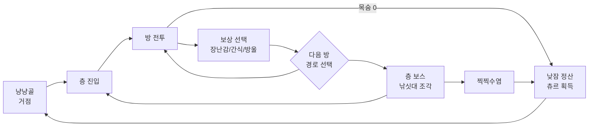
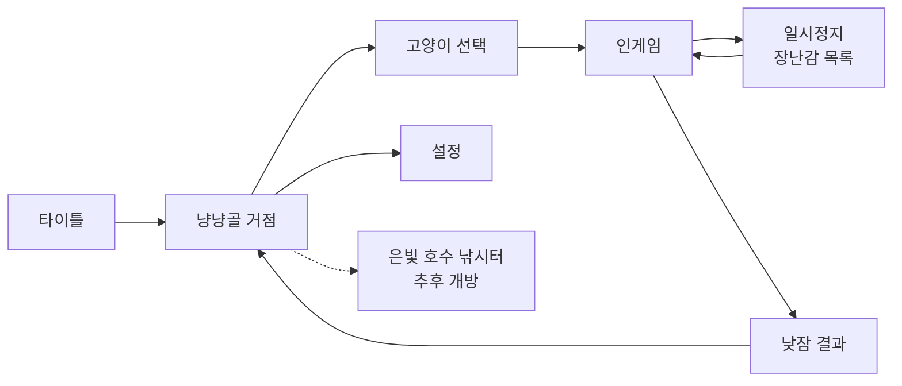

# 웹 로그라이크 게임 기획서 (가제: 고양이는 실패하지 않아)

2026-09-23 · 이필우

## 1. 게임 개요

아기 고양이 '치즈'가 쥐 해적단에게 빼앗긴 마을의 보물 낚싯대를 되찾으러 떠나는 귀여운 탑다운 액션 로그라이크다. 쓰러져도 낮잠 한숨 자고 다시 일어나는 고양이답게, 실패가 곧 다음 도전의 발판이 된다.

| 항목 | 내용 |
| --- | --- |
| 장르 | 탑다운 액션 로그라이크 (Hades, Enter the Gungeon 계열) |
| 플랫폼 | PC 크롬 브라우저 (WebGL2 우선, WebGPU 옵션) |
| 조작 | 키보드+마우스 기본, 게임패드 지원 (Gamepad API) |
| 1런 길이 | 20~30분 (4층 + 최종 보스) |
| 타깃 | 전연령. 고양이를 좋아하는 캐주얼층 + 짧은 세션을 반복하는 코어 게이머 |
| 톤 | 밝은 파스텔, 폭력 표현 없음. 적은 쓰러지면 '뿅' 연기와 함께 도망간다 |
| 가제 | 고양이는 실패하지 않아 (Cats Never Fail) |

### 핵심 차별점

- **아홉 목숨**: 런마다 목숨 몇 개를 들고 시작한다. 쓰러지면 목숨 하나를 쓰고 그 자리에서 부활하며, 거점 강화로 최대 9개까지 늘린다. 모두 쓰면 낮잠에 빠져 마을에서 깨어난다.
- **고양이 행동 = 게임플레이**: 식빵 굽기(가드), 우다다(필살 연타), 꾹꾹이(회복), 박스 숨기 같은 고양이 습성을 액션으로 만든다.
- **즉시 플레이**: URL 하나로 실행, 첫 전투까지 10초 이내.
- **낚시 확장**: 스토리의 중심 소재를 낚시로 두고, 이후 낚시 미니게임을 업데이트로 붙인다 (2장, 10장).

## 2. 세계관·시나리오

무대는 은빛 호수 곁 고양이 마을 '냥냥골'이다. 호수에 물고기를 불러 모으던 마을의 보물 '달빛 낚싯대'를 쥐 해적단이 훔쳐 가면서 이야기가 시작된다.

### 배경

- 냥냥골 고양이들은 대대로 은빛 호수에서 낚시하며 살아왔다. 보름달 밤의 '대어 축제'가 마을 최대 행사다.
- 달빛 낚싯대는 호수의 수호 물고기 '은비늘님'이 마을에 준 선물이다. 낚싯대가 마을에 있어야 호수에 물고기가 모인다.
- 쥐 해적단 선장 '찍찍수염'이 축제 전날 밤 낚싯대를 훔쳐 4조각으로 나누고, 부하 대장 넷에게 하나씩 맡겼다.
- 낚싯대가 사라지자 호수의 물고기도 자취를 감췄고, 마을은 생선 부족에 빠진다.

### 등장 고양이

| 이름 | 역할 | 설명 |
| --- | --- | --- |
| 치즈 | 주인공 | 치즈태비 아기 고양이. 낚시 실력은 마을 꼴찌지만 '목숨이 아홉 개'라는 말 하나 믿고 모험을 떠난다 |
| 누룽지 할매 | 거점 NPC | 은퇴한 낚시 명인. 되찾은 조각으로 낚싯대를 복원하고, 훗날 낚시를 가르친다 |
| 고등어 | 거점·상점 NPC | 떠돌이 상인 고양이. 런 안의 상점도 운영한다 |
| 찍찍수염 | 최종 보스 | 쥐 해적단 선장. 사실 자기도 물고기가 너무 먹고 싶었을 뿐이다 |

### 스토리 진행과 낚시 연결

| 단계 | 사건 | 낚시 연결 |
| --- | --- | --- |
| 프롤로그 | 축제 전날, 누룽지 할매에게 낚시를 배우던 중 낚싯대 도난 | 첫 낚시 체험 자리 (미니게임 추가 전에는 연출 컷신으로 대체) |
| 1층 보스 | 손잡이 조각 회수 | 누룽지 할매 집에 복원 진행도 1/4 표시 |
| 2층 보스 | 낚싯줄 조각 회수 | 호수에 작은 물고기가 돌아오는 거점 연출 |
| 3층 보스 | 릴 조각 회수 | 호숫가에 낚시 좌대가 다시 세워짐 |
| 4층 보스 | 찌 조각 회수 | 복원 완료 직전, 누룽지 할매가 낚시 수업 예고 |
| 최종 보스 | 찍찍수염과 화해, 낚싯대 복원 | 은빛 호수 낚시터 개방 → 낚시 콘텐츠 해금 지점 |
| 엔딩 후 | 쥐 해적단까지 함께하는 대어 축제 | 전설의 물고기 은비늘님 낚기가 장기 목표 |

낚싯대 조각은 런이 실패해도 한 번 얻으면 영구 보존된다. 그래서 스토리 진행이 메타 진행과 함께 움직이고, 낚시 해금이 자연스러운 보상이 된다.

## 3. 비주얼 방향 결정

추천안은 C안, 3D 로우폴리 필드 + 2D 스프라이트 캐릭터(빌보드)다. 필드는 3D라서 조명·그림자·카메라 연출을 살리고, 캐릭터는 스프라이트라서 애니메이션 제작 비용을 줄인다.

| 안 | 방식 | 장점 | 단점 | 제작 부담 |
| --- | --- | --- | --- | --- |
| A. 순수 2D | 타일맵 + 스프라이트 (PixiJS) | 가장 가볍고 빠름, 레퍼런스 많음 | 빛·그림자 연출 한계, 차별화 약함 | 픽셀아트 대량 필요 |
| B. 풀 3D | 3D 필드 + 3D 리깅 캐릭터 | 연출 자유도 최고 | 캐릭터 리깅·애니메이션 비용 큼, 웹 용량 증가 | 매우 큼 |
| **C. 2.5D (추천)** | 3D 필드 + 빌보드 스프라이트 캐릭터 | 동적 조명, 깊이감, 캐릭터 제작비 절감 | 스프라이트-3D 조명 매칭 작업 필요 | 중간 |

### C안 세부 규칙

- **카메라**: 쿼터뷰 고정 각도(피치 약 50도), 원근 카메라 FOV 30도 내외. 살짝 틸트시프트를 걸어 미니어처 디오라마처럼 보이게 한다.
- **필드**: 모듈 단위 3D 타일(2m 그리드). 모서리를 둥글게 베벨한 장난감 같은 형태, 벽·바닥·소품 킷으로 절차적 조립.
- **캐릭터·적**: 2~2.5등신 SD 비율, 큰 머리와 짧은 다리. 8방향 또는 4방향+좌우 반전 스프라이트 시트, 노멀맵을 함께 구워 필드 조명을 받게 한다.
- **톤**: 밝은 파스텔(크림, 민트, 살구, 하늘색). 따뜻한 햇살 1개 + 부드러운 그림자, 순수 검정은 쓰지 않는다.
- **이펙트**: 발바닥 자국, 하트, 별, 털뭉치 파티클. 적이 쓰러질 때는 '뿅' 연기 + 도망가는 뒷모습.

## 4. 코어 게임 루프

한 번의 런은 방 전투 → 보상 선택 → 다음 방 이동의 반복이다. 목숨을 다 쓰면 낮잠에 빠져 냥냥골에서 깨어나고, 모은 츄르로 마을을 키워 다시 떠난다.



런 안에서는 빌드를 쌓는 재미, 런 밖에서는 마을 성장과 낚싯대 복원이 반복 동기를 만든다.

| 루프 | 주기 | 플레이어가 하는 일 | 얻는 것 |
| --- | --- | --- | --- |
| 방 루프 | 30초~2분 | 쥐 해적 쫓아내기, 냥력 관리 | 방울(런 재화), 간식, 장난감 선택권 |
| 층 루프 | 5~7분 | 경로 선택, 상점·캣타워·상자방 | 빌드 완성도, 낚싯대 조각 |
| 런 루프 | 20~30분 | 4층 + 찍찍수염 도전 | 츄르(메타 재화), 해금 |
| 메타 루프 | 수 시간 | 마을 건물 강화, 고양이·장난감 해금 | 새 선택지, 낚시터 개방(추후) |

## 5. 전투·조작 시스템

전투는 실시간 액션이다. 모든 동작은 고양이 습성에서 따오고, 핵심 자원은 냥력 게이지와 아홉 목숨 두 가지다.

### 조작

| 입력 (KB+M) | 게임패드 | 동작 |
| --- | --- | --- |
| WASD | 왼쪽 스틱 | 이동 |
| 마우스 방향 | 오른쪽 스틱 | 조준 |
| 좌클릭 | RT | 냥펀치 (기본 3연타) |
| 우클릭 | LT | 털뭉치 던지기 (냥력 20 소모) |
| Space | A | 구르기 대시 (짧은 무적) |
| Shift 유지 | RB | 식빵 굽기: 제자리 가드, 정면 피해 70% 감소 |
| Q | LB | 우다다: 냥력 100일 때 화면을 휘젓는 필살 연타 |
| E | X | 상호작용 (상자 들어가기, NPC 대화) |

### 냥력 게이지

- 최대 100. 냥펀치 적중 시 +4, 피격 시 +2, 가만히 있으면 서서히 감소.
- 털뭉치 던지기 1회 20 소모. 100이 되면 우다다 사용 가능.
- 식빵 굽기로 공격을 막으면 +8 → 방어적인 플레이도 필살기로 이어진다.

### 아홉 목숨

- 기본 목숨 3개, 마을 강화로 최대 9개.
- 체력 0 → 목숨 1개 소모, 그 자리에서 체력 50%로 '냥!' 부활 + 1.5초 무적.
- 부활할 때 방울 일부를 흘린다 (주울 수 있음). 목숨 0 → 낮잠, 런 종료.
- 꾹꾹이(캣타워 방, 일부 장난감)로 체력 회복.

### 기본 스탯

| 스탯 | 기본값 | 설명 |
| --- | --- | --- |
| 체력 | 100 | 0이 되면 목숨 1개 소모 |
| 공격력 | 10 | 냥펀치 1타 피해 |
| 공격 속도 | 3회/초 | 냥펀치 연타 빈도 |
| 이동 속도 | 5m/초 | 구르기는 0.2초에 3m |
| 냥력 충전 | 100% | 냥력 획득 배율 |
| 치명타 | 5% / 150% | 확률 / 피해 배율 |

## 6. 절차적 맵 생성

맵은 2단계로 만든다. 층 단위로 방 그래프를 생성하고, 각 방은 손으로 만든 방 템플릿을 골라 3D 모듈 킷으로 조립한다.

### 층 구조

- 1층당 방 10~14개, 분기형 그래프. 방 문 위에 다음 방 보상 아이콘을 띄워 경로를 고르게 한다.
- 시드 기반 생성: 같은 시드 = 같은 맵. 데일리 챌린지와 버그 재현에 사용.

### 방 타입

| 방 타입 | 층당 개수 | 내용 |
| --- | --- | --- |
| 전투 | 6~8 | 쥐 해적 웨이브 1~3회, 클리어 시 보상 |
| 정예 전투 | 1~2 | 강화 적, 장난감 확정 보상 |
| 고등어 상점 | 1 | 방울로 장난감·간식·회복 구매 |
| 상자방(이벤트) | 1~2 | 상자에 들어가면 벌어지는 선택지 이벤트 |
| 캣타워(휴식) | 1 | 꾹꾹이로 체력 회복 또는 장난감 강화 중 택1 |
| 물가 (예약) | 0~1 | 낚시 포인트 자리. 낚시 업데이트 전에는 생성 비활성 |
| 보스 | 1 | 층 마지막 고정, 낚싯대 조각 보유 |

### 생성 알고리즘

1. 시드로 결정적 난수 생성기(mulberry32 등) 초기화.
2. 층 그래프 생성: 시작 → 보스까지 3~4갈래 경로, 방 타입 규칙과 활성 플래그에 맞춰 배치.
3. 방마다 크기·타입에 맞는 템플릿 선택 (그리드 데이터, JSON).
4. 템플릿 안의 랜덤 슬롯에 장애물·소품·함정 배치.
5. 모듈 킷으로 3D 메시 생성 후 InstancedMesh로 드로우콜 병합.
6. 네비게이션: 그리드 기반 A* (적 AI 경로 탐색).

## 7. 성장·아이템·빌드 시스템

런 안의 성장은 장난감(패시브)과 목걸이 방울(필살기 변형)로 이루어지고, 같은 계열 장난감을 모으면 시너지가 켜진다.

### 런 내 성장 요소

| 요소 | 획득 | 효과 예시 |
| --- | --- | --- |
| 장난감 | 정예·보스·상점·보상 선택 | 적을 쫓아낼 때 냥력 +5 / 구르기 끝에 털뭉치 3개 발사 |
| 목걸이 방울 | 층 보스 보상 (런당 최대 3개) | 우다다가 회오리로 바뀜 / 우다다 중 무적 |
| 간식 | 상자방 이벤트, 드롭 | 참치캔: 다음 방까지 공격력 +30% 같은 일회성 버프 |
| 소모품 | 드롭·상점 | 생선포(회복), 캣닢 주머니(냥력 충전), 방울 폭죽 |

### 장난감 시너지

장난감마다 4개 계열 중 하나가 붙는다. 같은 계열 3개·5개 보유 시 단계 보너스가 켜진다.

| 계열 | 콘셉트 | 3개 보너스 | 5개 보너스 |
| --- | --- | --- | --- |
| 털뭉치 | 투사체 강화 | 털뭉치 크기 +50% | 털뭉치가 튕기며 3회 반사 |
| 캣닢 | 속도·광란 | 이동속도 +20% | 냥력 100 동안 공격 속도 2배 |
| 박스 | 방어·반격 | 식빵 굽기 피해 감소 90% | 가드 성공 시 충격파 반격 |
| 레이저 포인터 | 추적·치명 | 털뭉치가 가까운 적 추적 | 레이저 표식 적에게 치명타 확정 |

### 메타 진행 (런 사이)

- **츄르**: 낮잠 정산 때 도달 층·쫓아낸 적 수에 비례해 획득.
- **마을 강화**: 캣타워(최대 체력), 방석 가게(시작 목숨 +1, 최대 9), 고등어 가게(상점 할인). 총 강화량은 기본 스탯의 약 30% 이내로 제한.
- **해금**: 새 고양이, 새 장난감을 획득 풀에 추가, 난이도 단계(쥐소동 레벨 1~10).
- **낚싯대 복원도**: 조각 4개 회수 상태를 영구 저장 (2장 스토리, 10장 확장 설계와 연동).

## 8. 콘텐츠 볼륨

정식 1.0 기준 고양이 3종, 바이옴 4개, 일반 적 20종, 보스 5종, 장난감 80개를 목표로 한다. 프로토타입은 고양이 1, 바이옴 1, 적 5, 보스 1, 장난감 20으로 시작한다.

### 바이옴 (층)

| 층 | 바이옴 | 환경 특징 | 기믹 | 보스 (조각) |
| --- | --- | --- | --- | --- |
| 1 | 해바라기 골목 | 담벼락, 화분, 빨랫줄 | 화분 뒤에 숨으면 원거리 공격 회피 | 뚱보쥐 도토리 (손잡이) |
| 2 | 안개 항구 | 나무 부두, 그물, 생선 상자 | 물가 많음, 파도에 밀림 (낚시 포인트 후보지) | 게 용병 집게대장 (낚싯줄) |
| 3 | 쥐굴 하수도 | 치즈 창고, 파이프 미로 | 치즈 덫: 밟으면 적도 아군도 끈적 | 로봇청소기 위이잉 3호 (릴) |
| 4 | 해적 비행선 | 갑판, 돛, 구름 | 바람이 불어 이동 방향 밀림 | 오이 대포 부선장 (찌) |
| 최종 | 선장실 | 보물 더미 아레나 | 낚싯대를 휘두르는 보스 패턴 | 찍찍수염 |

### 플레이어 고양이

| 고양이 | 공격 스타일 | 특징 | 해금 |
| --- | --- | --- | --- |
| 치즈 (치즈태비) | 냥펀치 근접 | 균형형, 목숨 +1로 시작 | 기본 |
| 까망 (검은 고양이) | 털뭉치 원거리 | 털뭉치 냥력 소모 절반, 체력 낮음 | 1층 보스 첫 처치 |
| 모찌 (삼색이) | 식빵 굽기 반격 | 가드 성공 시 냥력 2배, 느림 | 3층 도달 |

### 적 설계 원칙

- 바이옴당 쥐 해적 5종: 돌격 쥐, 새총 쥐, 폭죽 쥐, 소환 쥐(북 치는 쥐), 도둑 쥐.
- 도둑 쥐는 공통 테마 적으로, 가까이 오면 방울을 훔쳐 달아난다. 잡으면 두 배로 돌려받는다.
- 공통 방해물 '오이': 고양이가 보면 깜짝 놀라 튀어오르며 0.5초 경직된다.
- 모든 적은 공격 전 0.4초 이상의 예고 모션을 가진다 (스프라이트 + 바닥 데칼). 쓰러지면 피 대신 '뿅' 연기.

## 9. UI/UX

HUD는 둥근 말랑한 형태로 최소화하고, 목숨은 발바닥 아이콘 개수로 한눈에 읽히게 한다.

### 화면 흐름



### HUD 배치

| 위치 | 요소 |
| --- | --- |
| 좌상단 | 체력 바, 목숨(발바닥 아이콘 × 개수), 냥력 게이지 |
| 우상단 | 미니맵 (방 그래프, 방문한 방만 표시) |
| 좌하단 | 구르기·우다다 쿨다운 |
| 우하단 | 방울, 소모품 슬롯 |
| 화면 중앙 하단 | 장난감 획득 알림 (2초 표시 후 사라짐) |

### 저장

- 방 클리어 시점마다 자동 저장. 브라우저를 닫아도 해당 방부터 이어하기.
- 저장 위치는 IndexedDB. 메타 진행과 현재 런 상태를 분리 저장.
- 저장 데이터 내보내기·가져오기 (JSON 파일)로 브라우저 캐시 삭제에 대비.

### 접근성·편의

- 키 리매핑, 화면 흔들림 끄기, 색약 모드 (장난감 계열 아이콘에 모양 구분 추가).
- 창 포커스를 잃으면 자동 일시정지. 일시정지 화면에서 치즈가 식빵을 굽는다.

## 10. 기술 스택·아키텍처

Three.js + TypeScript + Vite 조합으로 간다. 레이싱 게임 프로젝트와 같은 기반이라 셋업과 Claude Code 작업 방식을 그대로 재사용할 수 있다.

| 영역 | 선택 | 비고 |
| --- | --- | --- |
| 렌더링 | Three.js (WebGL2) | WebGPURenderer는 옵션으로 후순위 |
| 언어·빌드 | TypeScript + Vite | 핫리로드, 정적 배포 |
| 충돌 | 자체 구현 (원·AABB + 그리드) | 탑다운이라 물리엔진 불필요. 필요 시 Rapier |
| 게임 구조 | 경량 ECS (bitECS 또는 자체) | 적·투사체 수백 개 처리 |
| 씬 관리 | 씬 스택 (push/pop) | 전투·거점·미니게임 씬 전환 |
| UI | HTML/CSS 오버레이 | 캔버스 위 DOM, 폰트 렌더링 품질 확보 |
| 사운드 | Howler.js | 오디오 스프라이트로 요청 수 절감 |
| 저장 | IndexedDB (idb 래퍼) | 9장 참고 |
| 배포 | GitHub Pages 또는 itch.io | 초기 로딩 목표 10MB 이하 |

### 성능 목표

- 중급 노트북 내장 그래픽(Intel Iris Xe급)에서 1080p 60fps.
- 드로우콜 200 이하: 필드는 InstancedMesh, 스프라이트는 아틀라스 1~2장으로 배칭.
- 조명: 햇살(디렉셔널) 1개만 그림자 캐스팅 + 앰비언트, 소품 포인트 라이트는 그림자 없이 최대 8개.
- 화면 내 적 최대 40, 투사체 최대 300.

### 낚시 확장 대비

낚시 미니게임 자체는 나중에 만들되, 붙일 자리는 v1부터 비워 둔다. 업데이트 때 기존 코드와 세이브를 건드리지 않는 것이 목표다.

| 확장 지점 | v1에서 해 둘 것 | 낚시 업데이트 때 할 것 |
| --- | --- | --- |
| 미니게임 구조 | `MiniGame` 인터페이스 (enter·update·exit·결과 반환), 씬 스택에 push | `FishingGame` 구현만 추가 |
| 맵 생성 | 방 타입 `fishing_spot` 정의, 활성 플래그 false | 플래그 on, 물가 템플릿 추가 |
| 거점 | 은빛 호수 낚시터 위치·입구만 배치 (잠김) | 입구 개방, 누룽지 할매 대화 연결 |
| 데이터 | `fish.json` 스키마 예약 (id, 서식 바이옴, 희귀도, 보상), 인벤토리 `fish` 카테고리 | 물고기 데이터 채우기 |
| 세이브 | 스키마 버전 필드, `rodRestore`(조각 진행도)·`fishDex`(도감) 필드 포함 | 마이그레이션 없이 값만 기록 |
| 보상 연결 | 보상 테이블에 `fish` 타입 허용 | 물고기 → 요리 버프·츄르 교환 |

### 코드 구조

```
src/
  core/       게임 루프, 입력, 시간, 이벤트 버스, 씬 스택
  ecs/        컴포넌트, 시스템 (이동·전투·AI·냥력·목숨)
  world/      맵 생성, 방 템플릿 로더, 모듈 킷 조립
  render/     씬, 카메라, 빌보드 스프라이트, 조명, 포스트프로세스
  minigames/  MiniGame 인터페이스 (낚시는 추후 여기에)
  data/       적·장난감·방 템플릿·물고기 JSON
  ui/         HUD, 메뉴 (DOM)
  save/       IndexedDB 저장·불러오기, 스키마 버전 관리
```

게임 데이터(적 스탯, 장난감 효과, 방 템플릿)는 전부 JSON으로 분리해 코드 수정 없이 밸런싱한다.

## 11. 아트·에셋 파이프라인

필드는 3ds Max 모듈 킷 → glTF, 고양이와 쥐는 SD 3D 모델을 렌더해 스프라이트 시트로 굽는다. 캐릭터를 직접 그리지 않고 3D에서 뽑으므로 3D 아트 역량을 그대로 쓸 수 있다.

### 필드 모듈 킷

| 단계 | 도구 | 규칙 |
| --- | --- | --- |
| 모델링 | 3ds Max | 2m 그리드 스냅, 피벗은 바닥 코너, 모서리 둥근 베벨, 모듈당 300~1,500 tri |
| 텍스처 | Substance Painter | 바이옴당 파스텔 트림시트 1장 + 타일 텍스처 2~3장, 1024px. 핸드페인팅 느낌의 단순한 색면 |
| 내보내기 | glTF 2.0 (.glb) | 바이옴별 1파일, 메시 이름 규칙 `bio_wall_straight_01` |
| 압축 | gltf-transform | Draco 또는 Meshopt + KTX2 텍스처 |

### 캐릭터 스프라이트

1. SD 비율 로우폴리 고양이·쥐 모델 + 애니메이션 제작 (또는 Tripo 등 AI 생성 후 리토폴로지).
2. 게임 카메라와 같은 각도의 카메라로 8방향 렌더, 외곽선은 셰이더로 얇게.
3. 컬러 + 노멀 패스를 함께 렌더 → 스프라이트가 필드 햇살에 반응.
4. TexturePacker 또는 자체 스크립트로 아틀라스 패킹 (2048px).
5. 애니메이션당 6~10프레임, 12fps 재생.

| 에셋 | 방향 | 애니메이션 |
| --- | --- | --- |
| 플레이어 고양이 | 8방향 | 대기(그루밍·꼬리 흔들기), 이동, 냥펀치 3연타, 털뭉치, 구르기, 식빵 굽기, 우다다, 피격, 낮잠 |
| 쥐 해적 | 4방향 + 반전 | 대기, 이동, 공격 예고, 공격, '뿅' 도망 |
| 보스 | 4방향 + 반전 | 패턴별 3~5종 |

렌더 → 패킹 → JSON 메타데이터 생성까지는 Python 스크립트로 일괄 자동화한다. 물고기·낚시 소품은 낚시 업데이트 때 같은 파이프라인으로 추가한다.

## 12. 개발 로드맵

1인 사이드 프로젝트 기준 약 9개월, 5단계로 나누고 낚시는 출시 후 첫 업데이트로 붙인다. 각 단계 끝에 플레이 가능한 빌드를 배포해 피드백을 받는다.

| 단계 | 기간 | 범위 | 완료 기준 |
| --- | --- | --- | --- |
| M0 기술 검증 | 2주 | 3D 필드 + 빌보드 고양이 스프라이트 + 파스텔 조명 톤, 이동·구르기 | 내장 그래픽 60fps, 귀여운 톤 확인 |
| M1 코어 프로토타입 | 6주 | 방 1개 전투, 쥐 3종, 냥력·아홉 목숨, 장난감 5개 | 한 방 전투가 재미있는가 판단 |
| M2 버티컬 슬라이스 | 8주 | 1층 절차적 생성, 방 타입 전부, 보스 1, 장난감 20, 프롤로그, 저장 (낚시 필드 포함 스키마) | 1층 런 완주 10분, 외부 테스터 5명 |
| M3 알파 | 10주 | 바이옴 4개, 적 20종, 보스 5, 마을 강화, 고양이 2, 스토리 전체 | 엔딩까지 완주 가능 |
| M4 베타·출시 | 10주 | 장난감 80, 고양이 3, 쥐소동 단계, 사운드, 최적화 | itch.io 공개, 데일리 시드 |
| U1 낚시 업데이트 | 출시 후 | 은빛 호수 낚시터, 물가 방, 물고기 도감 | 10장 확장 지점만으로 추가 완료 |

M1이 가장 중요한 관문이다. 방 하나 전투가 재미없으면 콘텐츠를 늘리기 전에 전투 감각부터 다시 잡는다.

## 13. 리스크와 결정 필요 사항

가장 큰 리스크는 빌보드 스프라이트가 3D 필드에서 붕 떠 보이는 문제와, 목숨이 많아 긴장감이 사라지는 문제다. 둘 다 M0~M1에서 먼저 검증한다.

| 리스크 | 영향 | 대응 |
| --- | --- | --- |
| 스프라이트와 3D 필드의 이질감 | 비주얼 품질 저하 | 노멀맵 스프라이트, 발밑 블롭 섀도, 필드 채도를 스프라이트에 맞춤 |
| 목숨이 많아 너무 쉬움 | 긴장감 저하 | 부활 시 체력 50%·방울 흘림, 쥐소동 단계에서 시작 목숨 감소 |
| 귀여운 이펙트가 전투 가독성을 해침 | 억울한 피격 | 적 공격 예고 색을 한 가지로 고정, 파티클 밀도 옵션 |
| 저사양 성능 | 플레이 불가 | 그래픽 품질 3단계, 그림자 해상도·포스트프로세스 옵션 |
| 브라우저 캐시 삭제로 저장 유실 | 이탈 | 저장 내보내기, 추후 계정 연동 검토 |
| 콘텐츠 볼륨 과다 | 일정 초과 | M2 이후 장난감·적 수를 데이터 기반으로 조정 |

### 결정 필요 사항

- [ ] 비주얼 C안(3D 필드 + 스프라이트) 확정 여부
- [ ] 시작 목숨 개수 (기본 3개안)
- [ ] 고양이·마을·보스 이름 확정 (치즈, 냥냥골, 찍찍수염은 가칭)
- [ ] 모바일 크롬 지원 범위 (터치 조작 포함 여부)
- [ ] 수익 모델: 무료 공개, 유료(itch.io), 스팀 이식 중 목표
